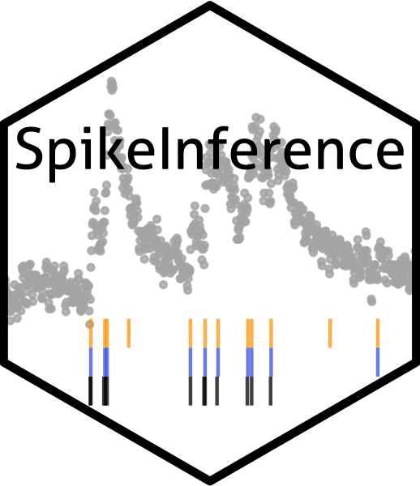

# SpikeInference 
Quantifying uncertainty for spikes estimated from calcium imaging data

`SpikeInference` is an `R` package for quantifying uncertainty (i.e., obtaining valid p-values and confidence intervals) for spikes estimated from calcium imaging data via an  penalized algorithm described in Jewell and Witten (2018) and Jewell et al. (2019).

## Installation

To download the SpikeInference package, use the code below.
``` r
# install.packages("devtools")
devtools::install_github("yiqunchen/SpikeInference")
library(SpikeInference)
```

Note that `SpikeInference` imports the package `Rcpp`. If the installation process fails on MAC OS due to issues related to `R` and `cpp` compiler tools, this [post](https://thecoatlessprofessor.com/programming/cpp/r-compiler-tools-for-rcpp-on-macos/) might provide some useful information.

## Use

The vignette demonstrates example usage of all main functions. Please [file an issue](https://github.com/yiqunchen/SpikeInference/issues) if you have a request for a tutorial that is not currently included. You can see the vignette by using the following code (note that this requires a TeX installation to view properly):
``` r
# install.packages("devtools")
devtools::install_github("yiqunchen/SpikeInference", 
	build_vignette = TRUE, build_opts = c())
```

## Citation

If you use `SpikeInference` for your analysis, please cite our manuscript:

Yiqun Chen, Sean Jewell, and Daniela Witten. (2021). Uncertainty quantification for
spikes estimated from calcium imaging data. (insert arxiv link)

## Bug Reports / Change Requests

If you encounter a bug or would like make a change request, please file it as an issue [here](https://github.com/yiqunchen/SpikeInference/issues).

## Additional References
Jewell, S. and Witten, D. (2018). Exact spike train inference via l0 optimization. Ann. Appl. Stat., 12(4):2457–2482.

Jewell, S. W., Hocking, T. D., Fearnhead, P., and Witten, D. M. (2019b). Fast nonconvex deconvolution of calcium imaging data. Biostatistics.
