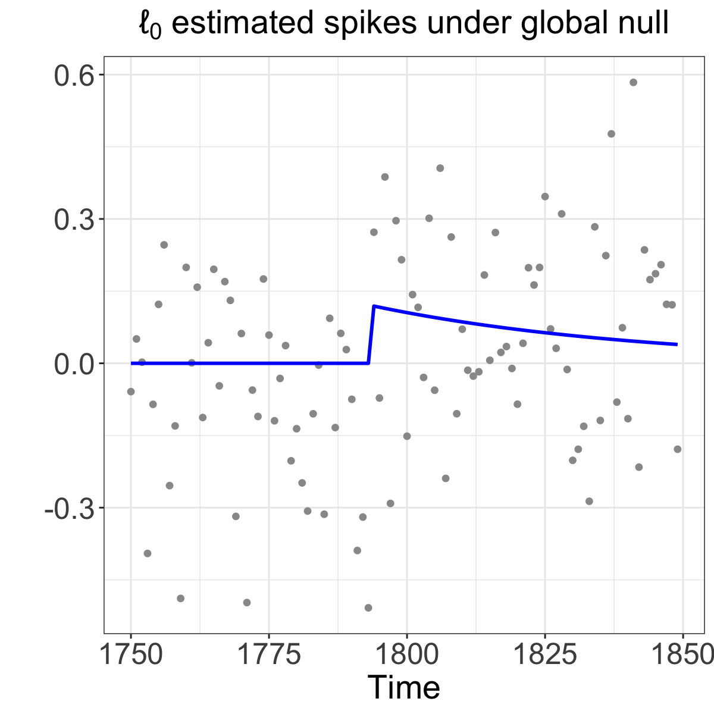
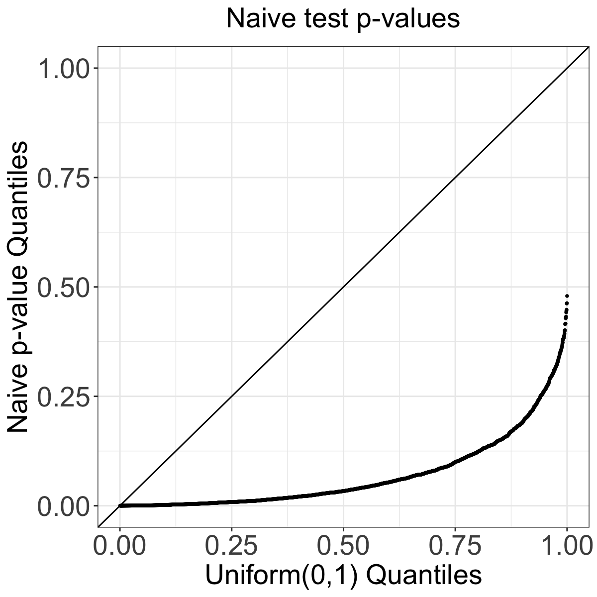
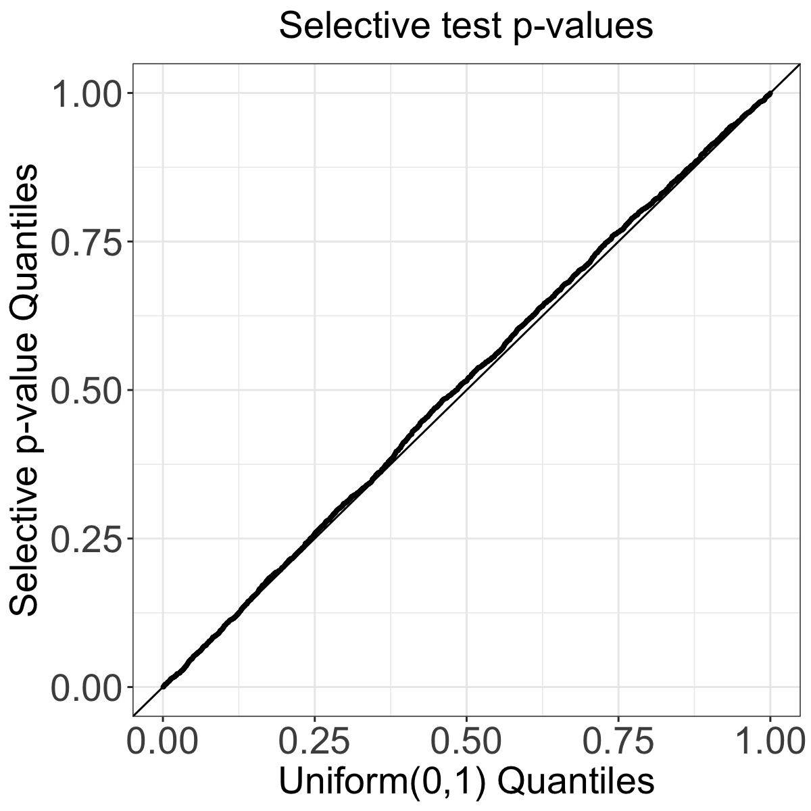

# SpikeInference 

### What is SpikeInference?

`SpikeInference` is an `R` package for quantifying uncertainty (i.e., obtaining valid p-values and confidence intervals) for spikes estimated from calcium imaging data via the  penalized algorithm described in Jewell and Witten (2018) and Jewell et al. (2020). Details can be found in our manuscript (Chen et al. 2021).

### How do I install the package?

To download the SpikeInference package, use the code below.
``` r
require("devtools")
devtools::install_github("yiqunchen/SpikeInference")
library(SpikeInference)
```
Note: `SpikeInference` imports the package `Rcpp`. If the installation process fails on MAC OS due to issues related to `R` and `cpp` compiler tools, this [post](https://thecoatlessprofessor.com/programming/cpp/r-compiler-tools-for-rcpp-on-macos/) might provide some useful information.

### Why do we need SpikeInference?
Double-dipping &mdash; or more formally, generating a hypothesis based on your data, and then testing the hypothesis on that same data &mdash; renders classical hypothesis tests (e.g., z-test or Wilcoxon-rank for a difference-in-means; and in general any standard hypothesis tests) invalid, in the sense that Type I error is not controlled.

In the case of spike estimation on calcium imaging data, our goal is to test whether the estimated spikes are, in fact, associated with a true increase in calcium. However, the estimated spikes were obtained from the same data used for testing. Therefore, if we aren't careful, we will have a problem with double-dipping, and reject the null hypothesis too often.

As an example, we generate a time series of calcium imaging data according to a model with no spikes at all (see the leftmost figure below). The  algorithm estimated a spike at timepoint 1793. If we ignore the issue of double-dipping, and test the null hypothesis that there is no increase in calcium at timepoint 1793 using a Wald test, we get a  p-value <0.001. By contrast, our double-dippling-adjusted method yields a p-value of 0.24. Our result makes our sense here, since we simulated data with no true spikes. 

In fact, if we repeat this process for a bunch of times (~3,000 tests), we see that the Wald test leads to extremely *inflated Type I error* (see the middle figure below). By contrast, our selective test controls the Type I error at the nominal level (see the rightmost figure below).

<div>
<figure>



</figure>
</div>

### Link to additional resources
* You can learn more about the technical details in our manuscript and in the [technical details section](https://yiqunchen.github.io/SpikeInference/articles/technical_details.html). 
* You can learn more about how to use our software in the  [tutorials section](https://yiqunchen.github.io/SpikeInference/articles/Tutorials.html).
* Finally, code and steps to reproduce the figures in our manuscript can be found in the GitHub repo [https://github.com/yiqunchen/SpikeInference-experiments](https://github.com/yiqunchen/SpikeInference-experiments). 

### Citation

If you use `SpikeInference` for your analysis, please cite our manuscript:

Chen YT, Jewell SW, Witten DM. (2021) [Quantifying uncertainty in spikes estimated from calcium imaging data](https://arxiv.org/abs/2103.07818). arXiv:2103.0781 [statME].

### Bug Reports / Change Requests

If you encounter a bug or would like to make a change request, please file it as an issue [here](https://github.com/yiqunchen/SpikeInference/issues).

### References
Chen YT, Jewell SW, Witten DM. (2021) Quantifying uncertainty in spikes estimated from calcium imaging data. arXiv:2103.0781 [statME].

Jewell, S. and Witten, D. (2018). Exact spike train inference via l0 optimization. Ann. Appl. Stat., 12(4):2457–2482.

Jewell SW, Hocking TD, Fearnhead P, Witten DM. Fast nonconvex deconvolution of calcium imaging data. Biostatistics. 2020;21(4):709-726. doi:10.1093/biostatistics/kxy083
