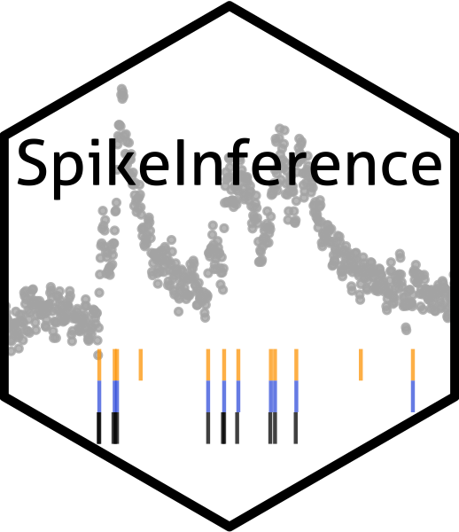

# SpikeInference 

### What is SpikeInference?
SpikeInference is an R package that quantifies uncertainty (i.e., calculating p-values and confidence intervals) for spikes estimated from calcium imaging data.

`SpikeInference` is an `R` package for quantifying uncertainty (i.e., obtaining valid p-values and confidence intervals) for spikes estimated from calcium imaging data via an  penalized algorithm described in Jewell and Witten (2018) and Jewell et al. (2019).

### How do I install the package?

To download the SpikeInference package, use the code below.
``` r
require("devtools")
devtools::install_github("yiqunchen/SpikeInference")
library(SpikeInference)
```
Note: `SpikeInference` imports the package `Rcpp`. If the installation process fails on MAC OS due to issues related to `R` and `cpp` compiler tools, this [post](https://thecoatlessprofessor.com/programming/cpp/r-compiler-tools-for-rcpp-on-macos/) might provide some useful information.

### Why do we need SpikeInference?
Double dipping — or more formally, generating a hypothesis based on your data, and then testing the hypothesis on that same data — renders classical hypothesis tests (e.g., z-test or t-test or Wilcoxon-rank for a difference-in-means; and in general any likelihood or Wald-based tests) invalid. 

In the case of spike estimation on calcium imaging data, our hypothesis is a function of the estimated spike locations, which in turn is a function of data. As an example, we generate a time series of calcium imaging data according to a model with no spikes at all (See Figure below), the  algorithm estimated a spike at timepoint 1793, which has a naive (Wald) p-value <0.001 (anti-conservative!); in contrast, our double-dippling-adjusted method yields a p-value of 0.24.


### Link to additional resources
* You can learn more about the technical details in our manuscript and in the technical setup section here. 
* You can learn more about how to use our software here.
* Finally, code and steps to reproduce the figures in our manuscript can be found in the GitHub repo here. 

### Citation

If you use `SpikeInference` for your analysis, please cite our manuscript:

Yiqun Chen, Sean Jewell, and Daniela Witten. (2021). Uncertainty quantification for
spikes estimated from calcium imaging data. 

### Bug Reports / Change Requests

If you encounter a bug or would like make a change request, please file it as an issue [here](https://github.com/yiqunchen/SpikeInference/issues).

### References
Yiqun Chen, Sean Jewell, and Daniela Witten. (2021). Uncertainty quantification for
spikes estimated from calcium imaging data. 

Jewell, S. and Witten, D. (2018). Exact spike train inference via l0 optimization. Ann. Appl. Stat., 12(4):2457–2482.

Jewell, S. W., Hocking, T. D., Fearnhead, P., and Witten, D. M. (2019b). Fast nonconvex deconvolution of calcium imaging data. Biostatistics.
